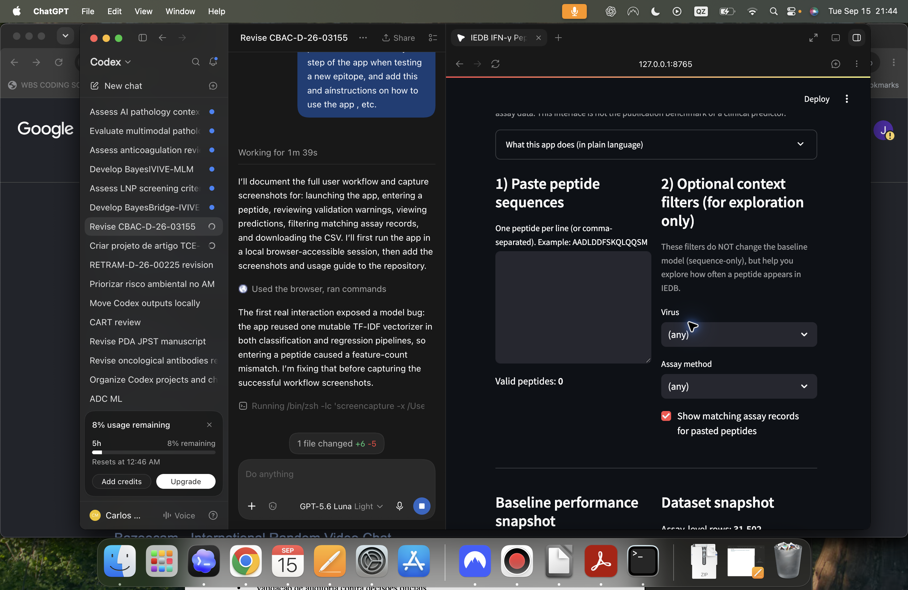
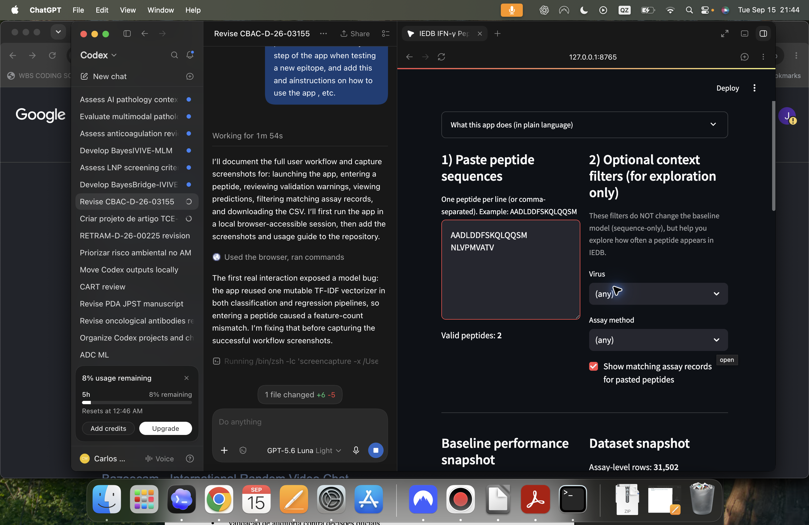
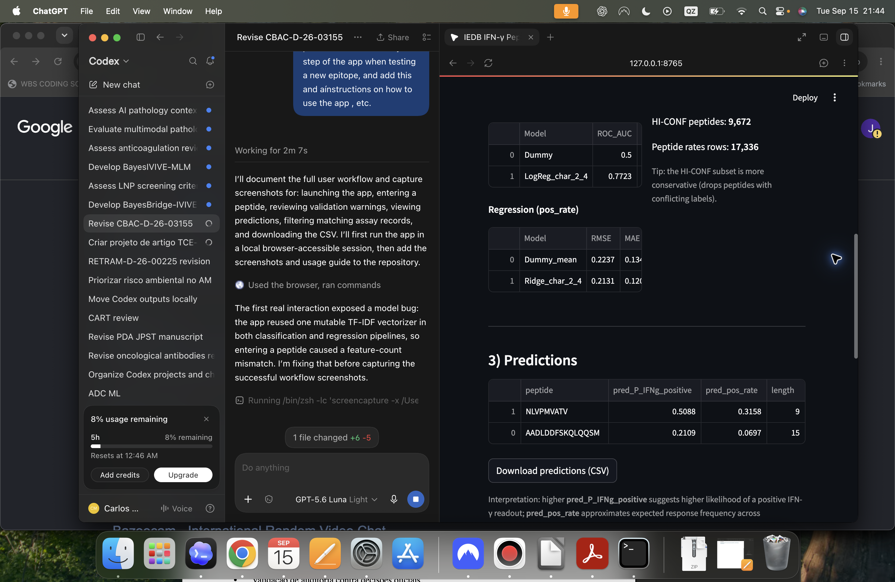

# IEDB Streamlit application

This app is an exploratory interface for ranking user-supplied peptide sequences with simple character n-gram baselines trained from the repository-curated IEDB tables. It is useful for demonstrating the workflow and inspecting where a peptide appears in the source table. It is not the publication benchmark, a calibrated clinical model, or a substitute for laboratory validation.

## Run locally

From the repository root:

```bash
streamlit run apps/iedb_streamlit/app.py
```

The app expects the repository data under `data/curated/`. No Google Drive mount is required.

## Test a new epitope

1. Launch the app and confirm the warning beneath the title. It identifies the app as an exploratory baseline.
2. Paste one peptide per line, or provide comma-separated peptides. Use uppercase amino-acid sequences; invalid characters are reported and ignored.
3. Press `Command+Enter` on macOS or `Ctrl+Enter` on Windows/Linux to apply the input.
4. Check **Valid peptides** before interpreting any output.
5. Review **Predictions**. `pred_P_IFNg_positive` is a relative sequence-only score from the logistic baseline. `pred_pos_rate` is an estimated peptide-level response rate from the Ridge baseline. Higher values rank candidates earlier; they are not individual probabilities.
6. Review the **Dataset snapshot** and baseline metrics to understand the training context.
7. Use the optional virus and assay-method filters only to inspect matching IEDB records. They do not change the sequence-only prediction.
8. Inspect **Where do these peptides appear in IEDB?** to see matching records and source-virus context.
9. Select **Download predictions (CSV)** to save the ranked candidates for a screening worksheet.

## Screenshots








## Interpretation and safety limits

- The app is sequence-only. Its context filters are for browsing and do not add context features to the model.
- The displayed baseline metrics are a smoke-test snapshot, not the corrected publication metrics in `results/`.
- Do not treat scores as the probability that a peptide will be immunogenic in a specific person.
- Do not use the app alone to choose vaccine composition, treatment, or claims of protective immunity.
- Combine ranking with HLA binding and presentation evidence, conservation, safety review, and prospective IFN-gamma experiments.

## Provenance

The original app was preserved in the project Drive archive as `app.py`, `requirements.txt`, and an app README. The adapted version here reconciles its file paths with the current repository and fixes the vectorizer reuse bug that caused prediction-time feature mismatches.

- Drive folder: `https://drive.google.com/drive/folders/1RZa4ruVhqgqPhurbDz0TeTrE97-BHp8O`
- Original app: `https://drive.google.com/file/d/1fAcveyPdTKvvPBKKp6RCAYCZ5vihJD0l/view`
